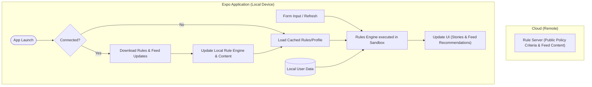
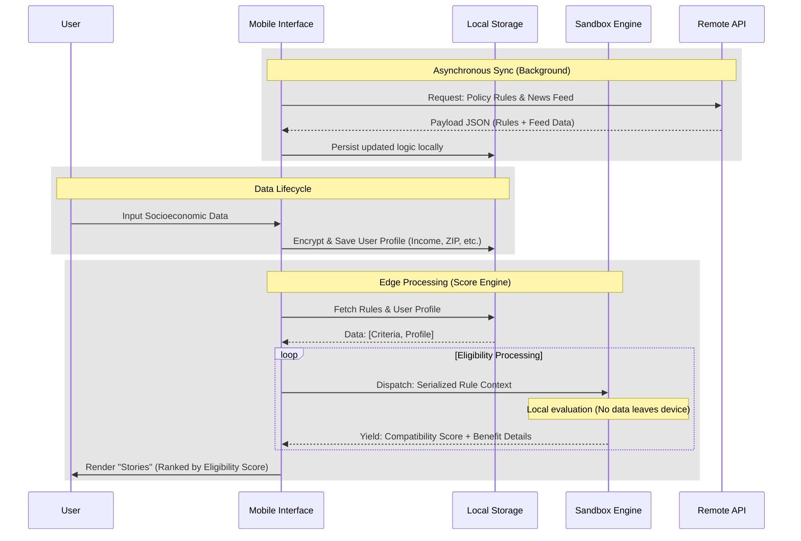

# Pol.Pop: Technical Documentation

## I. An executive Summary

Pol.Pop (Políticas Populares) is a social-tech solution designed to bridge the gap between vulnerable populations and public benefits in Brazil. Operating in a landscape of what we call **asymmetric modernization**: official portals often remain inaccessible due to high data consumption, information fragmentation, complex interfaces and bad integration between official government infrastructure. Pol.Pop utilizes Edge Computing and Offline-First architecture to ensure access to rights regardless of connectivity.

## II. The Problem Statement & Justification

The project addresses three critical barriers in the Brazilian public sector:

- **Infrastructure Fragmentation**: Federal, state, and municipal data systems rarely communicate, leaving citizens unaware of benefits across different spheres.
- **Digital Exclusion**: Approximately 14% of Brazilian households lack internet access [^1], and 87% of the poorest access the web exclusively via mobile devices[^2] with limited prepaid data plans[^3].
- **Cognitive Barrier**: Standard government portals (Gov.br) are often too complex for users with low digital literacy.

## III. About the System Architecture

Pol.Pop shifts the processing burden from the server to the user's device. This Edge Computing approach ensures privacy, reduces server costs, and enables offline functionality.

### Overview

The following diagram illustrates the data flow between the remote rule repository and the local execution environment.



### Data Flow & Persistence

The system uses a non-blocking background synchronization cycle to ensure the "Rules Engine" is always up-to-date with the latest Diário Oficial (Official Gazette) changes without requiring user intervention.



## IV. The Reverse Digital Literacy Approach

The interface is built on the concept of **Reverse Digital Literacy**. Instead of training the user to understand bureaucracy, the app mimics popular social media patterns in the country to lower the cognitive load.
- **Opportunity Feed**: A vertical scroll interface mirroring TikTok & Instagram for public policy updates.
- **Benefit Stories**: A horizontal story format mirroring WhatsApp for highlighting eligible benefits.
- **Low-Weight Visuals**: Optimized for low-resolution screens and cracked displays.

## V. Privacy & Security (Lei Geral de Proteção de Dados)

By adopting a local-first processing model, Pol.Pop is compliant by design with the LGPD (General Data Protection Law).
- Sensitive data (CPF, Income, NIS) is never sent to the cloud.
- The server may only receives anonymized telemetry (if enabled), version requests and data requests for updating the local engine.
- The comparison engine runs in an isolated environment to prevent unauthorized access to user data.

## VI. Technical Stack

| Component | Technology | Rationale |
| :--- | :--- | :--- |
| Framework | Expo / React Native | Rapid cross-platform deployment and easy updates. |
| Data Engine | Lightweight JSON Rule Engine | Enables evaluation flexibility. |
| Storage | SQLite / Encrypted Storage | Ensures fast local querying and security for sensitive data. |
| Connectivity | Offline-First (Sync on Connect) | Vital for users who rely on "borrowed" Wi-Fi (e.g., bakeries/shelters). |

[^1]: http://cetic.br/media/analises/tic_domicilios_2025_principais_resultados.pdf#page=12
[^2]: http://cetic.br/media/analises/tic_domicilios_2025_principais_resultados.pdf#page=13
[^3]: https://idec.org.br/sites/default/files/versao_revisada_pesquisa_locomotiva.pdf#page=12

## VII. Data Schema

How data look like:

#### Internal User Local Storage

Is a SQL table, each row represents a profile

| NAME | CPF | BIRTH | NIS | CEP | INCOME | HOUSING_SITUATION | HOUSING_COMPOSE |
|------|-----|-------|-----|-----|--------|-------------------|-----------------|

#### Payload JSON

Example of the data schema that the remote server sends to the device (containting the welfare benefits rules & feed pots) # I need to change all "benefits" mentions to Welfare Benefits to keep it standardized

```json
{
	"welfare" : [
		{
			"title" : "Bolsa Família 2016",
			"scope" : 0, // 0 → federal; 1 → state; 2 → municipal; 3 → other
			"rules" : [ "(INCOME / len(HOUSING_COMPOSE)) <= 218" ] // This snipets of code are evaluated on an isolated sandbox
		}
	],
	"feed" : [
		{
			"title" : "INSS garante acesso a benefícios no 12º Mutirão PopRuaJud do Distrito Federal",
			"recap" : "O Instituto Nacional do Seguro Social (INSS) realizou 150 atendimentos presenciais nesta segunda-feira (27), durante o 12º Mutirão PopRuaJud – Distrito Federal. A ação ocorreu no Pavilhão de Exposições do Parque da Cidade, em Brasília (DF), com o objetivo de ampliar o acesso a serviços essenciais à população em situação de rua.\n\nOs cidadãos tiveram acesso a orientações previdenciárias e ao serviço de protocolo de requerimentos, com foco em benefícios assistenciais ao idoso e à pessoa com deficiência. A qualidade do atendimento foi um dos pontos destacados por Marcos Angelosi Ribeiro, que procurou o mutirão para dar entrada no Benefício de Prestação Continuada (BPC). “Consegui dar entrada no benefício e ainda estou no meio do processo, mas até agora fui muito bem atendido. Estou satisfeito com a assistência que recebi aqui”, afirmou.\n\nIdalia Martins Nunes também ressaltou a importância da iniciativa. “Vim buscar o BPC para o meu filho, que tem autismo. Aqui foi mais fácil resolver tudo, facilitou muito para a gente”, relatou. Já para Eric Coutinho, que também buscava dar entrada no BPC, a agilidade foi um diferencial. “O atendimento foi ótimo, rápido e eficiente. Já saí com o requerimento encaminhado, agora é só acompanhar o andamento”, destacou.",
			"image" : "", // Image buffer object encoded in base64 string
			"links" : "https://www.gov.br/inss/pt-br/assuntos/inss-garante-acesso-a-beneficios-no-12o-mutirao-popruajud-do-distrito-federal"
		},
		{
			"title" : "CRAS Santarenzinho realiza programação cultural com usuários do Serviço de Convivência e Fortalecimento de Vínculos",
			"recap" : "A Prefeitura de Santarém, por meio da Secretaria Municipal de Trabalho e Assistência Social (Semtras), realizou na manhã desta quarta-feira (29) uma programação cultural especial com usuários do Serviço de Convivência e Fortalecimento de Vínculos (SCFV) do Centro de Referência de Assistência Social (Cras) Santarenzinho.\n\nA ação reuniu crianças, adolescentes, idosos e seus familiares no auditório da unidade, marcando o início de um novo ciclo de atividades voltadas à convivência, ao aprendizado e ao fortalecimento dos vínculos familiares e comunitários.\n\nA programação contou com apresentações protagonizadas pelos próprios usuários do serviço, incluindo danças regionais como carimbó, forró e a tradicional dança do boto. O encerramento foi marcado por uma apresentação coletiva que emocionou o público presente, evidenciando o papel da cultura como instrumento de inclusão social e valorização das diferentes faixas etárias atendidas pelo SCFV.",
			"image" : "", // Image buffer object encoded in base64 string
			"links" : "https://santarem.pa.gov.br/noticias/assistencia-social/cras-santarenzinho-realiza-programacao-cultural-com-atendidos-pelo-servico-de-convivencia-e-fortalecimento-de-vinculos-sv8dy5"
		}
	]
}
```