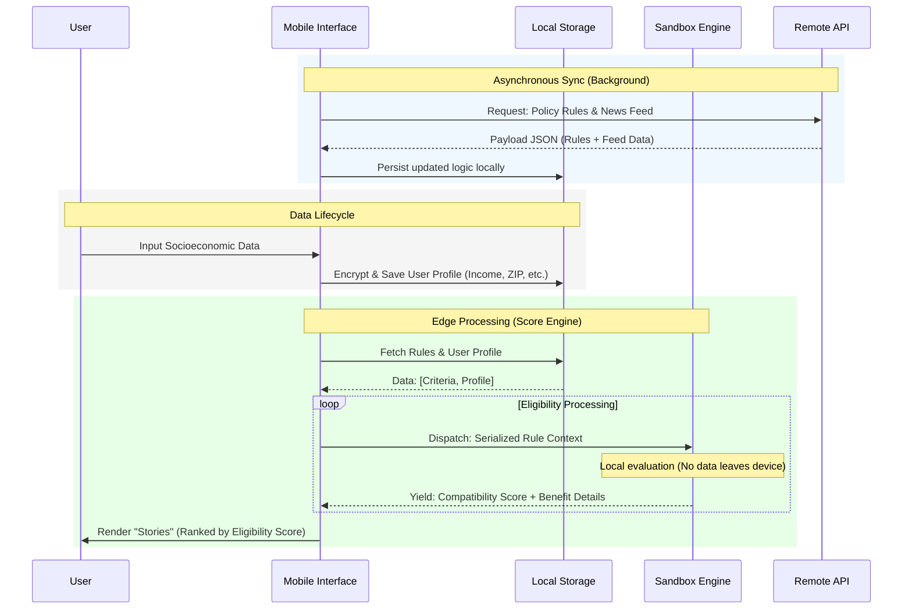

# Pol.Pop: Technical Documentation

## I. An executive Summary

Pol.Pop (Políticas Populares) is a social-tech solution designed to bridge the gap between vulnerable populations and public benefits in Brazil. Operating in a landscape of what we call **asymmetric modernization**: official portals often remain inaccessible due to high data consumption, information fragmentation, complex interfaces and bad integration between official government infrastructure. Pol.Pop utilizes Edge Computing and Offline-First architecture to ensure access to rights regardless of connectivity.

## II. The Problem Statement & Justification

The project addresses three critical barriers in the Brazilian public sector:

- **Infrastructure Fragmentation**: Federal, state, and municipal data systems rarely communicate, leaving citizens unaware of benefits across different spheres.
- **Digital Exclusion**: Approximately 14% of Brazilian households lack internet access^[http://cetic.br/media/analises/tic_domicilios_2025_principais_resultados.pdf#page=12], and 87% of the poorest access the web exclusively via mobile devices^[http://cetic.br/media/analises/tic_domicilios_2025_principais_resultados.pdf#page=13] with limited prepaid data plans^[https://idec.org.br/sites/default/files/versao_revisada_pesquisa_locomotiva.pdf#page=12].
- **Cognitive Barrier**: Standard government portals (Gov.br) are often too complex for users with low digital literacy.

## III. About the System Architecture

Pol.Pop shifts the processing burden from the server to the user's device. This Edge Computing approach ensures privacy, reduces server costs, and enables offline functionality.

### Overview

The following diagram illustrates the data flow between the remote rule repository and the local execution environment.

### Data Flow & Persistence

The system uses a non-blocking background synchronization cycle to ensure the "Rules Engine" is always up-to-date with the latest Diário Oficial (Official Gazette) changes without requiring user intervention.

## IV. The Reverse Digital Literacy Approach

The interface is built on the concept of **Reverse Digital Literacy**. Instead of training the user to understand bureaucracy, the app mimics popular social media patterns in the country to lower the cognitive load.
- **Opportunity Feed**: A vertical scroll interface mirroring TikTok & Instagram for public policy updates.
- **Benefit Stories**: A horizontal story format mirroring WhatsApp for highlighting eligible benefits.
- **Low-Weight Visuals**: Optimized for low-resolution screens and cracked displays.

## V. Privacy & Security (Lei Geral de Proteção de Dados)

By adopting a local-first processing model, Pol.Pop is compliant by design with the LGPD (General Data Protection Law).
- Sensitive data (CPF, Income, NIS) is never sent to the cloud.
- The server may only receives anonymized telemetry (if enabled), version requests and data requests for updating the local engine.
- The comparison engine runs in an isolated environment to prevent unauthorized access to user data.

## VI. Technical Stack

| Component | Technology | Rationale |
| :--- | :--- | :--- |
| Framework | Expo / React Native | Rapid cross-platform deployment and easy updates. |
| Data Engine | Lightweight JSON Rule Engine | Enables evaluation flexibility. |
| Storage | SQLite / Encrypted Storage | Ensures fast local querying and security for sensitive data. |
| Connectivity | Offline-First (Sync on Connect) | Vital for users who rely on "borrowed" Wi-Fi (e.g., bakeries/shelters). |